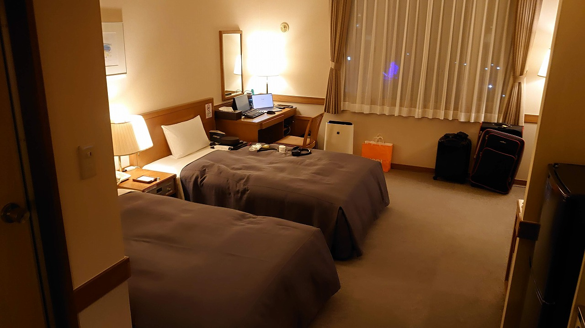

### 2022/01/05
### 日記
- 浦河ウエリントンホテルで起床、起きてすぐに窓から朝日と海が見える景色が最高 
- 北海道ホテル朝食あるあるなのかもしれないが朝ごはんのおかずの量がとても多くてビビる。卵とじみたいなやつが美味しかった。また、日高地元のパン屋さんが作った食パンがもちもちしててとても美味しかった 
- ホテルチェックアウトが10時なので早めに出るも、ホテルの送迎は１４時で依頼してしまったのでかなり時間が余る
- ホテル目の前のバス停時刻表を見ると 10:38, 13:08 で送迎待ち合わせ場所の日赤前(正しくはそのすぐ近くの浦河バスターミナル)行があるらしい
- バスの真下が商業施設になっているので、ゆっくりそこでくつろいで行こうと計画するも百円ショップと謎の中古買取ショップと小さな食堂と小さなゲーセンしか入っていない…
- 幸いにもゲーセンにmaimaiがおいてあったのでそれで時間をつぶすことに 
- お昼は小さな食堂（ラーメン横丁）でラーメンを頂く。ラーメンはごくごくシンプルで鳥と節のきいた醤油ラーメン７００円、美味しかった。名物は昆布ラーメンらしいのでまた食べに来よう。 
- バスに乗って浦河高校前へ、運賃はワンメーターで170円だった。なお、バス停の時刻表に書いてない停留所にバンバン止まったので路線間違えたかと思ってちょっと怖かった。
- 浦河ターミナル（Coop併設）に到着。Coopで食料と酒をかって時間までバス待機所でまつ
- 迎えが来たのでそのままAERUへ、道中左右に牧場が何個かあり、お馬さんが放牧されているのが見えてテンションが上がる。
- AERU到着、長期滞在、お部屋の説明を受ける、優しいスタッフさんで良かった。
- お部屋には既に配送した荷物がデプロイされていた
- 手荷物と配送荷物の荷ほどき＆お部屋チェック。思ったよりも広くてここでもテンションが爆上がり  
- ここまでの移動で疲れが最高潮だったので温泉へ。温泉は日帰り入浴可能で地元の人が沢山いた。
- 湯上りに瓶コーラで一服しながら中山金杯を応援、1600円負けました
- そのままレストランへ、最初の晩餐は釜めしセット、つぶ貝とえびが入った釜めし、おいしゅうございました。  
- 部屋に戻ってバタンキューしつつもこのログを作成中
- 明日は町役場職員さんの町内案内と、友達がこの部屋に泊まりに来るイベントがあるので今からワクワク