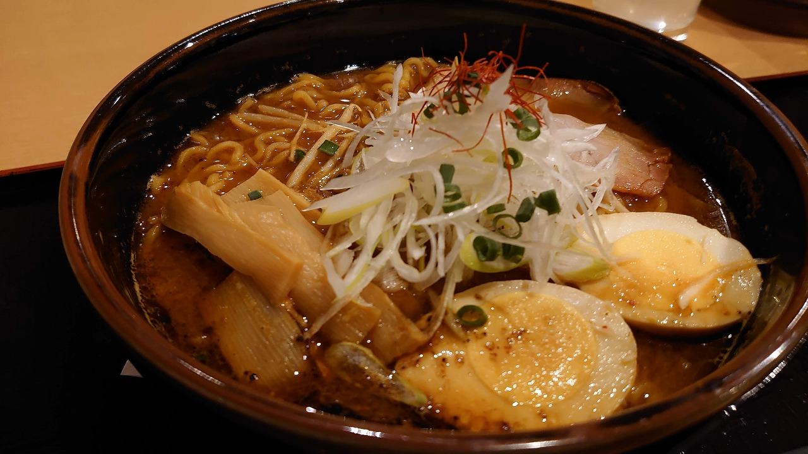
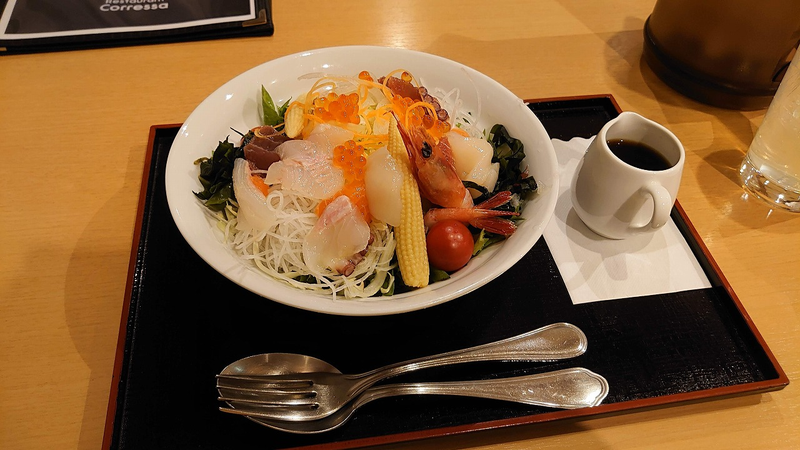

### 2022/01/07
### 日記
- 今日は朝から友人と二人で乗馬体験、僕は一度夏に乗っていたが冬はまた景色が全然違って良い体験でした。コロンちゃんありがとう 
- 乗馬後にはニンジンを持ってお馬さんの見学、チケットは一度ニンジンを上げるとずっとついてくる上にジーっとこっちを見てくるので何度もあげたくなってしまう…でも高齢馬だからと我慢…。 タイムパラドックスとスズカフェニックスはあげないと柵を嚙みだすしでなんとも申し訳ない気持ちでいっぱいに
- AERUに戻って温泉からの湯上りビール、完璧な休日を過ごしてしまった…
- 友人が帰ったのちは部屋でゆっくり…だけどやはり広い部屋に１人は寂しい…今までいた分余計意識してしまう…
- 夕飯は馬辛…ならぬ旨辛味噌ラーメンと刺身サラダハーフ 、刺身サラダハーフは明らかにレギュラーサイズな上に500円で載せていい量じゃない海鮮てんこ盛り(いくら、えび、ほたて、マグロ、サーモン、etc...)で明らかにコストパフォーマンスが高すぎてビビる
