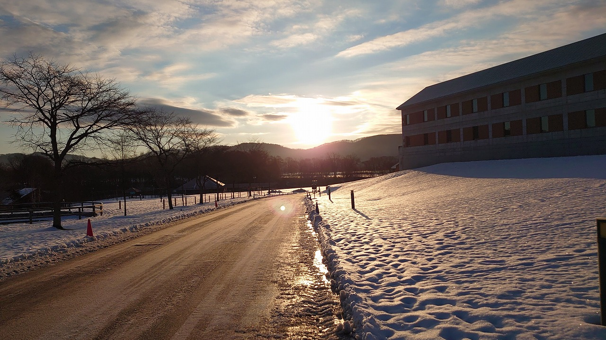
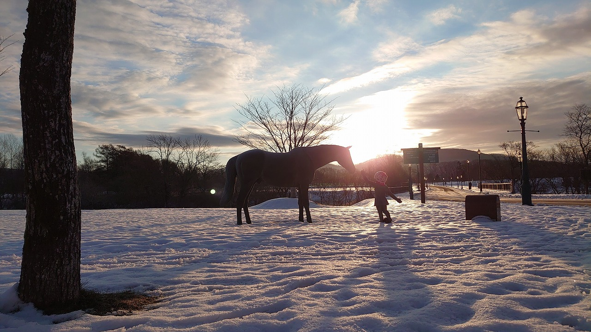
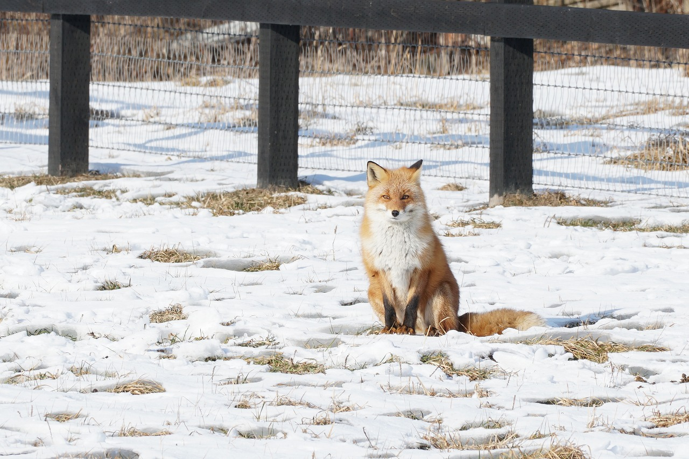
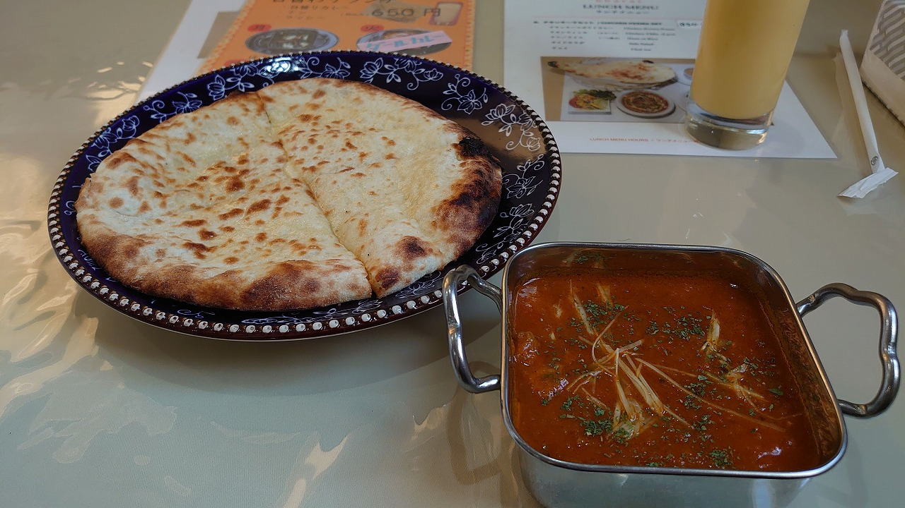

### 2022/01/08
### 日記
- 今日は朝からAERUの周辺をぶらり散歩。美しい雪景色と、当たり前のようにその辺にいる馬や野生生物を目の当たりにして浦河に来たことを再実感   
- お昼はAERU近くのBAHARATというインド料理屋さんで美味しいチキンカレーとチーズナン。 インドはイギリスの植民地だった影響で馬のお仕事をする方が多く、浦河もその需要でインドの方が多いという話を聞いた
- 昼食のすぐ後全身蕁麻疹を発症してタクシーで病院の急患にお世話になるという大アクシデントが発生。大事には至らなかったものの心配だったのでその日は病院近くのホテル(ホテルイースト)に泊まることに。