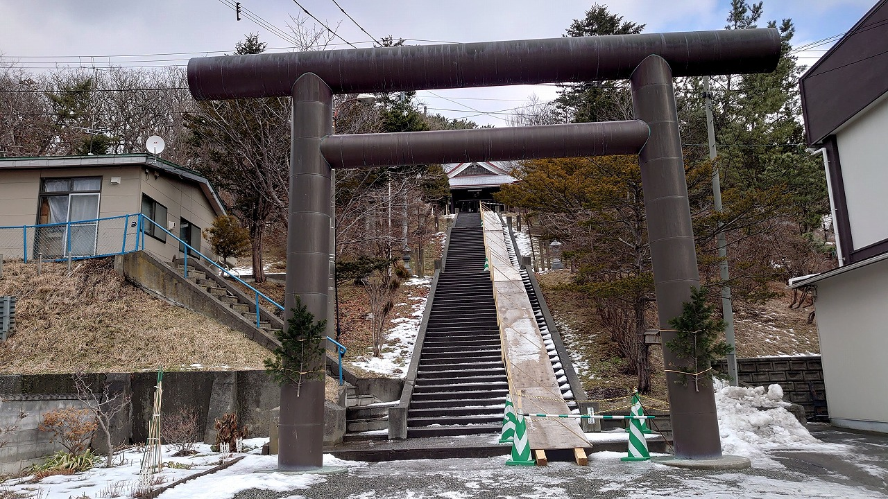
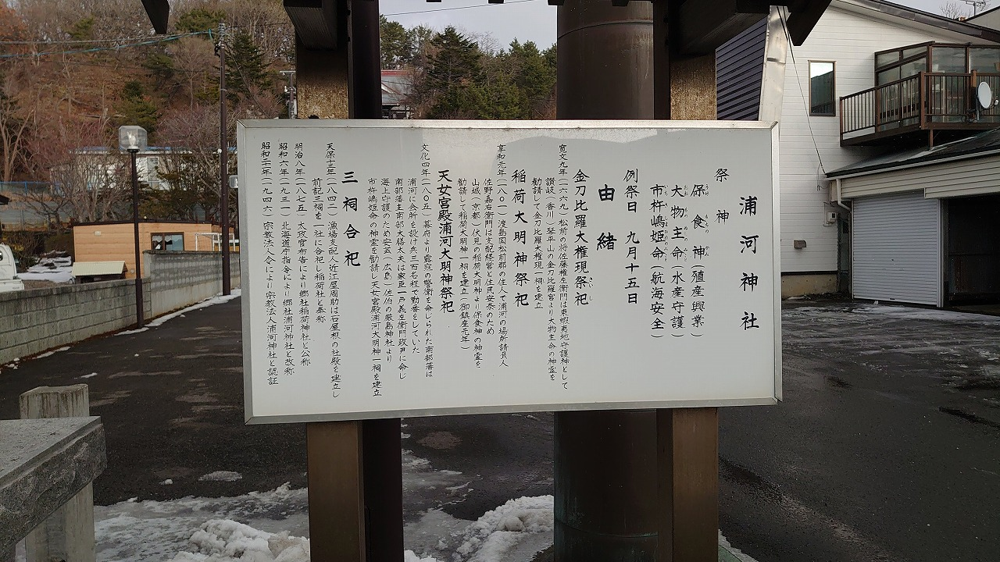
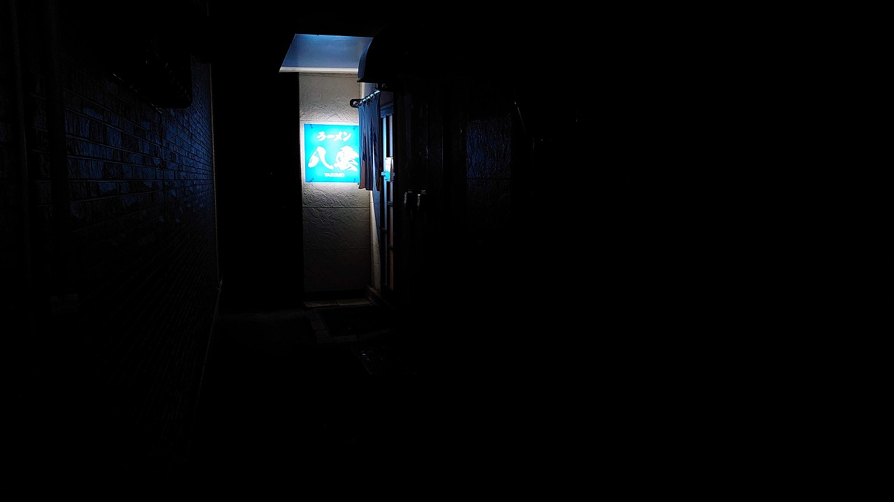
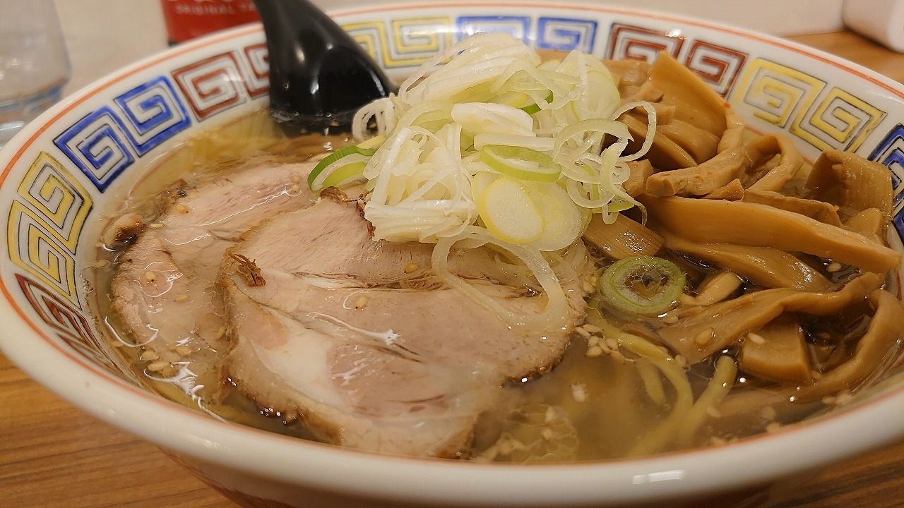

### 2022/01/09
### 日記
- 想定外の外泊からのホテルイーストで起床。折角町中まで出てきたので (AERUは街はずれなので…) これを好機と堺町～町役場～大通りを町ブラ。朝日と港が美しかったり、鷲(?)の写真が撮れたりと良い収穫があった、ありがとう蕁麻疹。    
- 大通りには浦河神社があったのでご挨拶を兼ねてお参り、無事楽しい旅が続きますように�  
- 夜はラーメン八雲の塩。純連の正式な暖簾分けらしいが、塩は純連よりも油少なめのさっぱり系、これはこれでなかなか美味かった。 